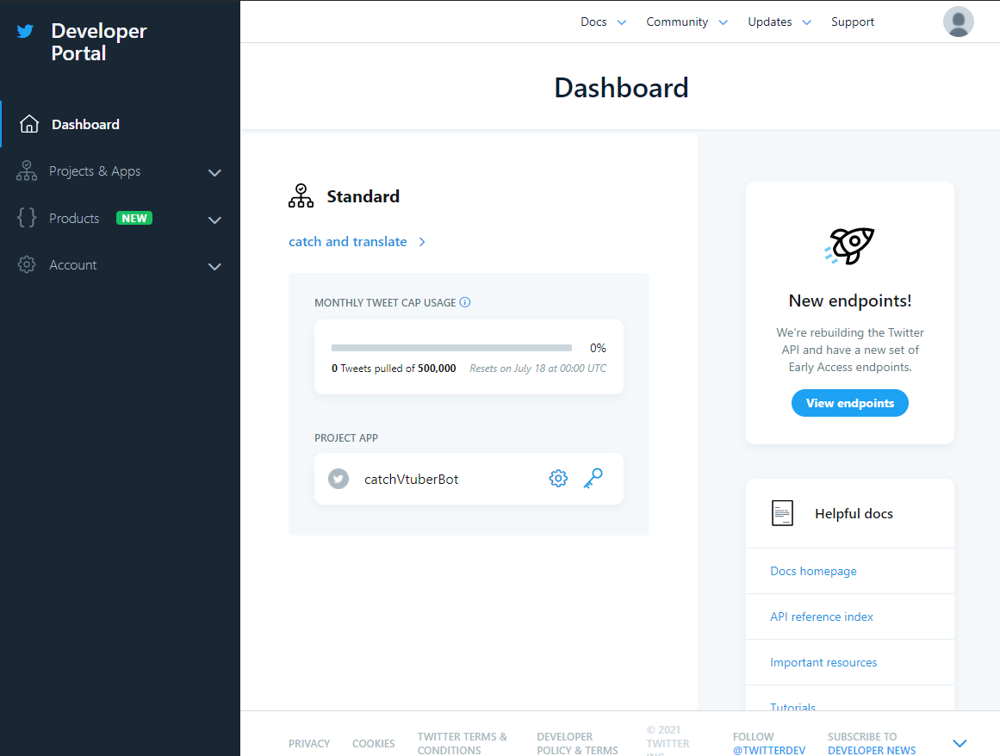
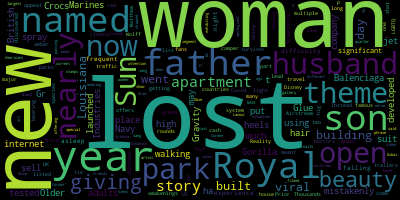

## twitter-sentiment-analysis
此專案是用於分析Twitter推文內容的文本情緒分析

抓取Tweet及文本情緒分析的部分使用Twitter API搭配NLTK，文字雲使用wordCloud模組，視覺化圖表由pyecharts。

---
## 目錄

- 使用前的設定
- 需引入的模組及API
- 功能詳述
- 成果展示
- 參考資料

---
## 使用前的設定
[步驟之參考來源](https://cyeninesky3.medium.com/%E4%BD%BF%E7%94%A8-nltk-%E6%90%AD%E9%85%8D-twitter-api-%E6%8B%BF%E5%8F%96%E7%A4%BE%E7%BE%A4%E8%B3%87%E6%96%99-%E4%BB%A5%E5%B7%9D%E6%99%AE%E7%9A%84-twitter%E8%B3%87%E6%96%99%E7%82%BA%E4%BE%8B-2bd493f452a6)

因為上面的參考來源有點舊，這裡記下目前版本的步驟。

先至[這裡](https://apps.twitter.com)登入自己的Twitter帳號密碼，點選**Create New App**新增應用程式。


創建後出現以下畫面，這邊我選**Academic**中的**Student**，之後按下**Go started**進入下個畫面。


之後填入一些名稱及所在國家、程式能力程度等。

再下個畫面需要以英文描述如何使用Twitter API和Twitter Data，需要200字以上。

經過資料確認及同意使用說明等即可開始使用，進入畫面如下。



依參考網站所說
> 此步驟為設定呼叫 Twitter API 時的請求端，新增一個資料夾 twitter-files (可自行命名)，將 API key 的資訊儲存在 credentials.txt ，內容包含：
> ```text 
> app_key = YOUR CONSUMER KEY  
> app_secret = YOUR CONSUMER SECRET  
> oauth_token = YOUR ACCESS TOKEN  
> oauth_token_secret = YOUR ACCESS TOKEN SECRET
> ```

這裡附上我的[credentials.txt](./twitter-files/credentials.txt)

取得API key的地方與參考網站有些不同，這邊附上如何取得。


而環境變數的設定，由於我是用Pycharm實作，
與參考網站使用的jupyter notebook不同，
設定的部分我還不是很確定是否正確，但是設定完並沒有出現error。

**Run > Edit Configurations > Environment variables**


---
## 需引入的模組及API

[dependencies](./requirements.txt)

```python
from nltk.twitter import Twitter, Query, Streamer, TweetViewer, TweetWriter, credsfromfile
from nltk.twitter.common import json2csv
from nltk.corpus import twitter_samples
import pandas as pd
import os
from pathlib import Path
from nltk.sentiment.vader import  SentimentIntensityAnalyzer
from wordcloud import WordCloud
import re
from pyecharts.charts import Bar
from pyecharts import options as opts
```

---
## 功能詳述

### 獲取Twitter推文

```python
def getTweet(username):
    oauth = credsfromfile()  # 會搜尋 credentials.txt(預設)

    count = 20  # 設定拿取 tweets 資料則數
    # username = 'CNN'

    client = Query(**oauth)  # 歷史資料
    client.register(TweetWriter())  # 寫入
    client.user_tweets(username, count)  # 拿取 tweets 資料(count則)

    '''
    使用 json2csv 存取 tweets 資料 (text欄位)
    input_file 的 abspath 需參考寫入資料的路徑做修改
    '''

    lists = os.listdir('C:/Users/ninab/twitter-files')  # json檔路徑
    lists.sort(key=lambda fn: os.path.getmtime('C:/Users/ninab/twitter-files' + "\\" + fn))     # 檔案依新增時間排序

    input_file = twitter_samples.abspath('C:/Users/ninab/twitter-files/' + lists[-1])   # 取最新新增的檔案
    with open(input_file) as fp:
        json2csv(fp, 'tweets_text.csv', ['text'])   # 轉為csv檔

    return lists
```

透過nltk.twitter獲取資料流，我選擇使用Query(Search API)，
因為Query是回傳```.json```檔的結構化資料，最後在使用nltk的功能轉為```.csv```檔以供使用。

當使用者輸入Twitter ID後(@後的部分)，此時會抓取該用戶近20則推文內容。

```python
client = Query(**oauth)  # 歷史資料
client.register(TweetWriter())  # 寫入
client.user_tweets(username, count)  # 拿取 tweets 資料(count則)
```

這段跑完後會在**Console**回傳抓取推文所存的```.json```檔的路徑。


只要每跑一次就會產生一個新的```.json```檔，內容是照tweets時間新舊排序。
為了避免產生過多檔案，我增加了一段程式將舊的檔案刪去。

```python
def removeOldData(lists):
    for i in range(0, len(lists)-1, 1):
        filePath = Path('C:/Users/ninab/twitter-files/' + lists[i])     # 找到json檔位址
        try:
            filePath.unlink()   # 刪除該路徑檔案
        except OSError as e:
            print(f"Error:{ e.strerror}")
```

### 產生文字雲

```python
def wordCloud_grah(tweetList):
    text = " ".join(tweetList)  # 將所有推文合在一個string list中
    cloud = WordCloud().generate(text)  # 根據20則推文內容產生文字雲
    cloud.to_file('output.png')     # 產生圖片
```



### 分析文本情緒

```python
def bar_graph(tweetList):
    vader = SentimentIntensityAnalyzer()

    # data1 = []
    # data2 = []
    # data3 = []
    data4 = []
    column = []
    for tweet in tweetList:
        column.append("推文")     # x軸文字
        score = vader.polarity_scores(tweet)    # 根據每則推文進行情緒分析
```

使用NTLK裡的情感分析模塊Vader SentimentAnalyzer，分類有正面情緒(pos)、
負面情緒(neg)、中性(neu)，其中compound代表總分，我使用compound作為柱狀圖資料來源，
負數值代表負面情緒較多、圖為深藍色 ; 正值代表正面情緒較多、圖為紅色。

```python
        if score['compound'] > 0:       # 中位數
            data4.append(
                opts.BarItem(name="推文", value=score['compound'], itemstyle_opts=opts.ItemStyleOpts(color="#c23531")))
            # 正值為紅色
        elif score['compound'] == 0:
            data4.append(
                opts.BarItem(name="推文", value=score['compound'], itemstyle_opts=opts.ItemStyleOpts(color="#61a0a8")))
            # 0為中性情緒
        else:
            data4.append(
                opts.BarItem(name="推文", value=score['compound'], itemstyle_opts=opts.ItemStyleOpts(color="#2f4554")))
            # 負值為深藍色

    bar = Bar()
    bar.add_xaxis(column)   # 設定x軸
    bar.add_yaxis("綜合分析", data4)     # 設定y軸
    # bar.add_yaxis("負面", data1)
    # bar.add_yaxis("中性", data2)
    # bar.add_yaxis("正面", data3)
    bar.set_global_opts(title_opts=opts.TitleOpts(title="柱狀圖", subtitle="情緒變化趨勢"))  # 標題
    bar.render("output.html")   # 結果是html
```

[柱狀圖連結](./output.html)


---
## 成果展示


使用者輸入twitter ID即可得到該用戶近期20則推文的文字雲和情緒分析。
因NLTK的文本分析僅能分析英文，中文及其他語言還須其他套件，因此這邊暫時僅支持英語系國家的twitter用戶。


[情緒分析](./output.html)


---
## 結論

- twitter官方提供的 API 限制太多(比如不能以時間日期抓取推文、不能抓一周以上的推文)
，之後再嘗試其他 API 以得到更多數據。
  
  
- 情緒分析目前僅支持英文，中文分析還要再嘗試[找到的資料](https://iter01.com/404449.html)
，不確定裡面是否也可支持繁體字，另外還有中文斷字的工具[資料](https://ithelp.ithome.com.tw/articles/10207586)
  。
  
  
- 使用介面還需進步，加設網站之類的方式。


- pyecharts是很好用的視覺化工具，圖表很多樣、也有互動性，由於開發者是中國人
，所以很多資料及教學都是中文，而且官網就有很詳細的樣板。


---
## 參考資料

[使用 NLTK 搭配 Twitter API 拿取社群資料：以川普的 Twitter資料為例](https://cyeninesky3.medium.com/%E4%BD%BF%E7%94%A8-nltk-%E6%90%AD%E9%85%8D-twitter-api-%E6%8B%BF%E5%8F%96%E7%A4%BE%E7%BE%A4%E8%B3%87%E6%96%99-%E4%BB%A5%E5%B7%9D%E6%99%AE%E7%9A%84-twitter%E8%B3%87%E6%96%99%E7%82%BA%E4%BE%8B-2bd493f452a6)

[NLP情感分析(Sentiment Analysis)](https://medium.com/data-science-for-kindergarten/nlp%E6%83%85%E6%84%9F%E5%88%86%E6%9E%90-sentiment-analysis-%E5%88%A9%E7%94%A8%E8%87%AA%E7%84%B6%E8%AA%9E%E8%A8%80%E8%99%95%E7%90%86%E6%8A%80%E8%A1%93-%E5%88%86%E6%9E%90finviz%E6%96%B0%E8%81%9E%E9%A0%AD%E6%A2%9D-%E9%A0%90%E6%B8%AC%E7%BE%8E%E8%82%A1%E8%87%89%E6%9B%B8-fb-%E7%89%B9%E6%96%AF%E6%8B%89-tsla-%E7%9A%84%E5%B8%82%E5%A0%B4%E8%A1%8C%E6%83%85%E8%B6%85%E5%89%8D%E9%83%A8%E7%BD%B2-2f8aa0fbeeba)

[[Python] 使用 wordcloud 套件快速產生文字雲](https://clay-atlas.com/blog/2019/11/25/python-chinese-tutorial-cloudword-demo/)

[pyecharts](https://pyecharts.org/#/zh-cn/intro)